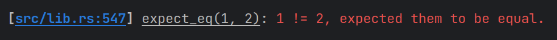

# Expecting

[](https://crates.io/crates/expecting)
[](https://docs.rs/expecting)
[](LICENSE)

**Expecting** provides macros for testing conditions without panicking. The
`expect_*` family of macros cause an early return of `anyhow::Error` if the
expected condition is not met.

| Macro                                 | Description                                            |
|---------------------------------------|--------------------------------------------------------|
| `expect!(condition)`                  | Expects `condition` to be `true`                       |
| `expect_eq!(a, b)`                    | Expects `a == b`                                       |
| `expect_ne!(a, b)`                    | Expects `a != b`                                       |
| `expect_some(option)`                 | Expects `option` to be `Some(x)` and returns `x`       |
| `expect_none(option)`                 | Expects `option` to be `None`                          |
| `expect_ok(result)`                   | Expects `result` to be `Ok(x)` and returns `x`         |
| `expect_err(result)`                  | Expects `result` to be `Err(e)` and returns `e`        |
| `expect_contains(container, element)` | Expects `container` (e.g., `Vec`) to contain `element` |
| `expect_empty(container)`             | Expects `container` to have no elements.               |
| `expect_contains(string, substr)`     | Expects `string` to contain `substr`                   |
| `expect_empty(string)`                | Expects `string` to have a length of zero.             |
| `expect_some_eq(some_a, a)`           | Expects `a` to be `Some` and `some_a == Some(a)`       |

This crate is especially helpful in async integration tests that involve
provisioning and tearing down resources; rather than struggle to catch panics,
you can simply use `expect_*` instead of `assert_*` to return `Result`.

## Examples

```rust
use expecting::expect_eq;

#[test]
fn passing_test() -> Result<()> {
    expect_eq!(1, 1);
    Ok(())
}

#[test]
fn failing_test() -> Result<()> {
    expect_eq!(1, 2);  // returns early
    Ok(())  // won't be reached
}
```

The error message for a failed test includes the line number and detailed
description of what went wrong.




See [the docs](https://docs.rs/expecting) for usage examples and more info.
